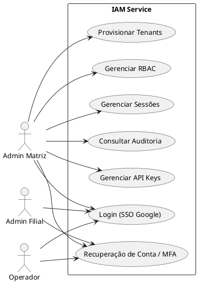
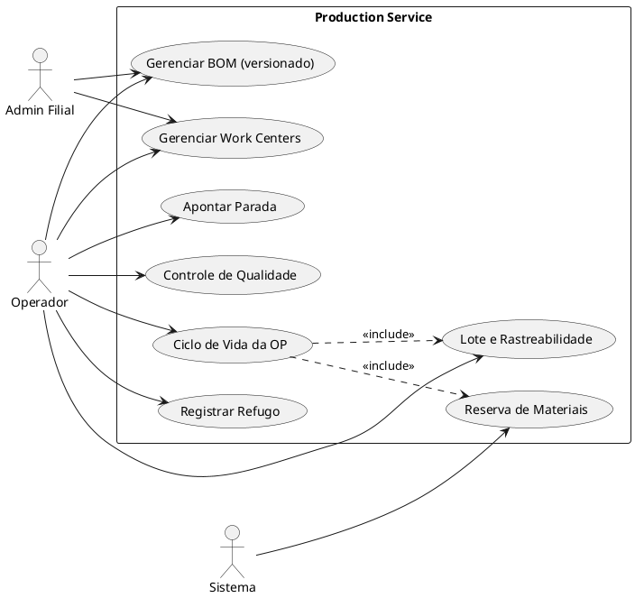
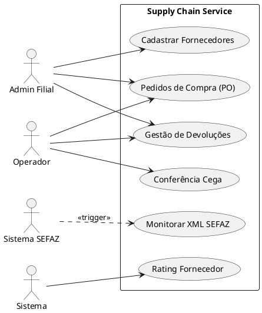
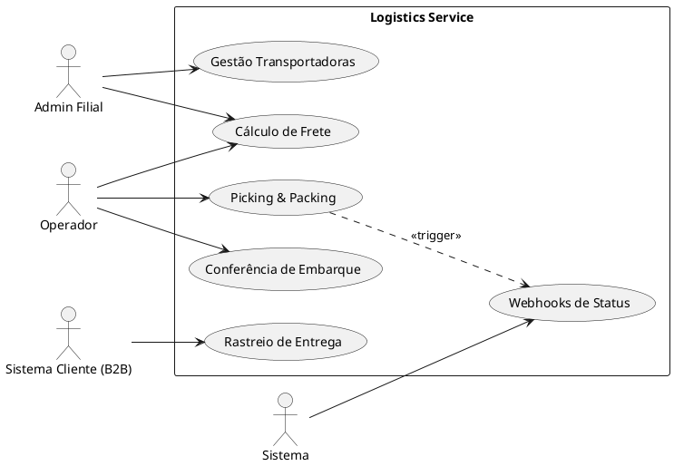
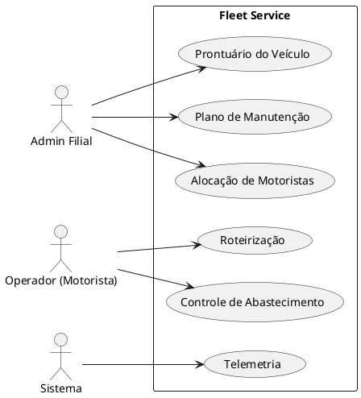
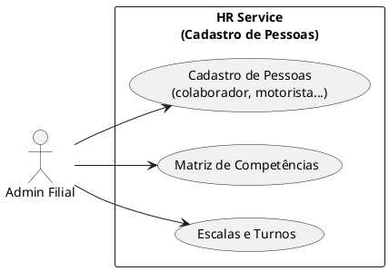
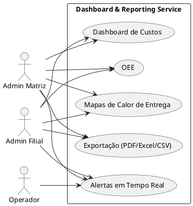

# Phase 0 — Use Case Diagrams (General and per Microservice)

This document provides the **Use Case Diagrams** for the RAIL Factory system: one **general** diagram and one diagram **per microservice**, aligned with [REQUIREMENTS.md](../REQUIREMENTS.md) and [MICROSERVICES.md](../MICROSERVICES.md).

---

## 1. Actors

| Actor | Type | Description |
|-------|------|-------------|
| **Admin Matriz** | Primary | Global view; manages tenants (headquarters + branches), RBAC, API keys, audit trails, consolidated dashboards. |
| **Admin Filial** | Primary | Unit-restricted view; manages users/roles for the branch, suppliers, fleet, HR config, and local dashboards. |
| **Operador** | Primary | Shop-floor user; executes production (OP, BOM usage), receiving, picking/packing, time tracking, and (if applicable) driver/vehicle operations. |
| **Sistema SEFAZ** | Secondary (External) | Source of NF-e data; system consumes XML/Manifestação do Destinatário. |
| **Sistema Cliente (B2B)** | Secondary (External) | Receives webhooks (dispatch status, tracking); may consume APIs. |

**Note — People as data (not actors):** The HR service holds **data about other people** (e.g. *motorista*, *colaborador*) who must be referenced in documents and by other services (Fleet, Production, Logistics). These people are **in the system as master data** but **do not necessarily have access** to it; only Admin Filial and Operador (for time logging) interact with their records.

---

## 2. General Use Case Diagram

The following diagram shows the **RAIL Factory** system boundary and the main use case packages (subsystems) with their primary actors.

```plantuml
@startuml RAIL-Factory-General-Use-Case
left to right direction
skinparam packageStyle rectangle
skinparam useCase {
  BackgroundColor<<iam>> LightBlue
  BackgroundColor<<prd>> LightGreen
  BackgroundColor<<sup>> LightYellow
  BackgroundColor<<log>> Orange
  BackgroundColor<<fle>> Pink
  BackgroundColor<<hr>> Lavender
  BackgroundColor<<dsh>> Wheat
}

actor "Admin Matriz" as AM
actor "Admin Filial" as AF
actor "Operador" as OP
actor "Sistema SEFAZ" as SEFAZ
actor "Sistema Cliente (B2B)" as B2B

rectangle "RAIL Factory" {
  rectangle "IAM" <<iam>> {
    usecase "Login (SSO Google)" as UC_IAM_Login
    usecase "Provisionar Tenants" as UC_IAM_Tenant
    usecase "Gerenciar RBAC" as UC_IAM_RBAC
    usecase "Gerenciar Sessões" as UC_IAM_Session
    usecase "Consultar Auditoria" as UC_IAM_Audit
    usecase "Gerenciar API Keys" as UC_IAM_ApiKey
    usecase "Recuperação de Conta / MFA" as UC_IAM_Recovery
  }
  rectangle "Production (Manufatura)" <<prd>> {
    usecase "Gerenciar BOM (versionado)" as UC_PRD_BOM
    usecase "Gerenciar Work Centers" as UC_PRD_WC
    usecase "Ciclo de Vida da OP" as UC_PRD_OP
    usecase "Reserva de Materiais" as UC_PRD_Reserve
    usecase "Registrar Refugo" as UC_PRD_Scrap
    usecase "Apontar Parada" as UC_PRD_Downtime
    usecase "Controle de Qualidade" as UC_PRD_QC
    usecase "Lote e Rastreabilidade" as UC_PRD_Lot
  }
  rectangle "Supply Chain (Inbound)" <<sup>> {
    usecase "Monitorar XML SEFAZ" as UC_SUP_SEFAZ
    usecase "Conferência Cega" as UC_SUP_Blind
    usecase "Cadastrar Fornecedores" as UC_SUP_Supplier
    usecase "Pedidos de Compra (PO)" as UC_SUP_PO
    usecase "Rating Fornecedor" as UC_SUP_Rating
    usecase "Gestão de Devoluções" as UC_SUP_Return
  }
  rectangle "Logistics (Outbound)" <<log>> {
    usecase "Picking & Packing" as UC_LOG_Pick
    usecase "Gestão Transportadoras" as UC_LOG_Carrier
    usecase "Rastreio de Entrega" as UC_LOG_Track
    usecase "Webhooks de Status" as UC_LOG_Webhook
    usecase "Conferência de Embarque" as UC_LOG_Ship
    usecase "Cálculo de Frete" as UC_LOG_Freight
  }
  rectangle "Fleet" <<fle>> {
    usecase "Prontuário do Veículo" as UC_FLE_Vehicle
    usecase "Plano de Manutenção" as UC_FLE_Maint
    usecase "Controle de Abastecimento" as UC_FLE_Fuel
    usecase "Alocação de Motoristas" as UC_FLE_Driver
    usecase "Roteirização" as UC_FLE_Route
    usecase "Telemetria" as UC_FLE_Telemetry
  }
  rectangle "HR (Cadastro de Pessoas)" <<hr>> {
    usecase "Cadastro de Pessoas (colaborador, motorista...)" as UC_HR_Profile
    usecase "Matriz de Competências" as UC_HR_Skills
    usecase "Escalas e Turnos" as UC_HR_Shifts
  }
  rectangle "Dashboard & Reporting" <<dsh>> {
    usecase "OEE" as UC_DSH_OEE
    usecase "Mapas de Calor de Entrega" as UC_DSH_Map
    usecase "Alertas em Tempo Real" as UC_DSH_Alerts
    usecase "Exportação (PDF/Excel/CSV)" as UC_DSH_Export
    usecase "Dashboard de Custos" as UC_DSH_Costs
  }
}

AM --> UC_IAM_Login
AM --> UC_IAM_Tenant
AM --> UC_IAM_RBAC
AM --> UC_IAM_Session
AM --> UC_IAM_Audit
AM --> UC_IAM_ApiKey
AM --> UC_IAM_Recovery
AM --> UC_DSH_OEE
AM --> UC_DSH_Map
AM --> UC_DSH_Alerts
AM --> UC_DSH_Export
AM --> UC_DSH_Costs

AF --> UC_IAM_Login
AF --> UC_SUP_Supplier
AF --> UC_SUP_PO
AF --> UC_LOG_Carrier
AF --> UC_FLE_Vehicle
AF --> UC_FLE_Driver
AF --> UC_HR_Profile
AF --> UC_HR_Shifts
AF --> UC_DSH_OEE
AF --> UC_DSH_Alerts
AF --> UC_DSH_Export
AF --> UC_DSH_Costs

OP --> UC_IAM_Login
OP --> UC_PRD_BOM
OP --> UC_PRD_WC
OP --> UC_PRD_OP
OP --> UC_PRD_Reserve
OP --> UC_PRD_Scrap
OP --> UC_PRD_Downtime
OP --> UC_PRD_QC
OP --> UC_PRD_Lot
OP --> UC_SUP_Blind
OP --> UC_LOG_Pick
OP --> UC_LOG_Ship
OP --> UC_FLE_Fuel
OP --> UC_FLE_Route

SEFAZ --> UC_SUP_SEFAZ
B2B --> UC_LOG_Webhook
B2B --> UC_LOG_Track

@enduml
```

---

## 3. Use Case Diagram per Microservice

### 3.1 IAM (Identity & Access Management)

| Use Case | RF | Primary Actor |
|----------|-----|----------------|
| Login (SSO Google) | RF-IAM-01 | Admin Matriz, Admin Filial, Operador |
| Provisionar Tenants | RF-IAM-02 | Admin Matriz |
| Gerenciar RBAC | RF-IAM-03 | Admin Matriz |
| Gerenciar Sessões | RF-IAM-04 | Admin Matriz |
| Consultar Auditoria | RF-IAM-05 | Admin Matriz |
| Gerenciar API Keys | RF-IAM-06 | Admin Matriz |
| Recuperação de Conta / MFA | RF-IAM-07 | All authenticated |

---

### 3.2 Production (Manufatura)

| Use Case | RF | Primary Actor |
|----------|-----|----------------|
| Gerenciar BOM (versionado) | RF-PRD-01 | Admin Filial, Operador (consult) |
| Gerenciar Work Centers | RF-PRD-02 | Admin Filial, Operador |
| Ciclo de Vida da OP | RF-PRD-03 | Operador |
| Reserva de Materiais | RF-PRD-04 | System (triggered by OP release) |
| Registrar Refugo | RF-PRD-05 | Operador |
| Apontar Parada | RF-PRD-06 | Operador |
| Controle de Qualidade | RF-PRD-07 | Operador |
| Lote e Rastreabilidade | RF-PRD-08 | System / Operador |

---

### 3.3 Supply Chain (Inbound)

| Use Case | RF | Primary Actor |
|----------|-----|----------------|
| Monitorar XML SEFAZ | RF-SUP-01 | Sistema SEFAZ (secondary) / Admin Filial |
| Conferência Cega | RF-SUP-02 | Operador |
| Cadastrar Fornecedores | RF-SUP-03 | Admin Filial |
| Pedidos de Compra (PO) | RF-SUP-04 | Admin Filial, Operador |
| Rating Fornecedor | RF-SUP-05 | System (automatic) |
| Gestão de Devoluções | RF-SUP-06 | Admin Filial, Operador |

---

### 3.4 Logistics (Outbound)

| Use Case | RF | Primary Actor |
|----------|-----|----------------|
| Picking & Packing | RF-LOG-01 | Operador |
| Gestão Transportadoras | RF-LOG-02 | Admin Filial |
| Rastreio de Entrega | RF-LOG-03 | Sistema Cliente (B2B) / Operador |
| Webhooks de Status | RF-LOG-04 | System → B2B |
| Conferência de Embarque | RF-LOG-05 | Operador |
| Cálculo de Frete | RF-LOG-06 | Admin Filial, Operador |

---

### 3.5 Fleet

| Use Case | RF | Primary Actor |
|----------|-----|----------------|
| Prontuário do Veículo | RF-FLE-01 | Admin Filial |
| Plano de Manutenção | RF-FLE-02 | Admin Filial |
| Controle de Abastecimento | RF-FLE-03 | Operador (motorista) |
| Alocação de Motoristas | RF-FLE-04 | Admin Filial |
| Roteirização | RF-FLE-05 | Operador / System |
| Telemetria | RF-FLE-06 | System |

---

### 3.6 HR (Cadastro de Pessoas / Dados de Terceiros)

This service maintains **data about people** who are referenced in documents and by other microservices (e.g. *motorista* in delivery docs, *colaborador* in production orders). These people **may not have system access**; they exist in the system as master data only.

| Use Case | RF | Primary Actor |
|----------|-----|----------------|
| Cadastro de Pessoas (colaborador, motorista...) | RF-HRS-01 | Admin Filial |
| Matriz de Competências | RF-HRS-02 | Admin Filial |
| Escalas e Turnos | RF-HRS-03 | Admin Filial |

---

### 3.7 Dashboard & Reporting

| Use Case | RF | Primary Actor |
|----------|-----|----------------|
| OEE | RF-DSH-01 | Admin Matriz, Admin Filial |
| Mapas de Calor de Entrega | RF-DSH-02 | Admin Matriz, Admin Filial |
| Alertas em Tempo Real | RF-DSH-03 | Admin Matriz, Admin Filial, Operador |
| Exportação (PDF/Excel/CSV) | RF-DSH-04 | Admin Matriz, Admin Filial |
| Dashboard de Custos | RF-DSH-05 | Admin Matriz, Admin Filial |

---

## 4. How to View the Diagrams

- **PlantUML**: Use the [PlantUML extension](https://marketplace.visualstudio.com/items?itemName=jebbs.plantuml) in VS Code/Cursor, or paste the code at [plantuml.com/plantuml](https://www.plantuml.com/plantuml/uml/).
- **Export**: From the extension, export to PNG/SVG for documentation or slides.

---

## 5. Traceability

- Each use case is aligned with the **RF-*** IDs in [REQUIREMENTS.md](../REQUIREMENTS.md).
- Actors follow the roles described in [MICROSERVICES.md](../MICROSERVICES.md) (Admin Matriz, Admin Filial, Operador).
- External actors (SEFAZ, B2B) represent system-to-system interactions for inbound and outbound integrations.
